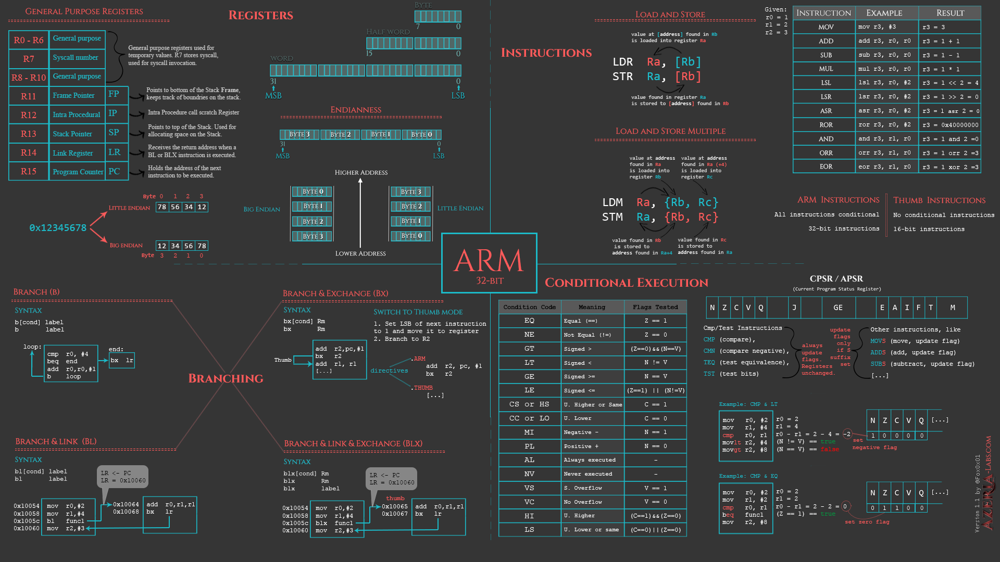

# Organiza tu Exposición equipo seleccionado por nickname.

Docente de hará entregar por GitHub MURO DE RED SOCIAL (click en el pulpo negro esquina izquierda)

El bloque que correponde presentar.

Simbolos de MarkDown: 

https://guides.github.com/features/mastering-markdown/

